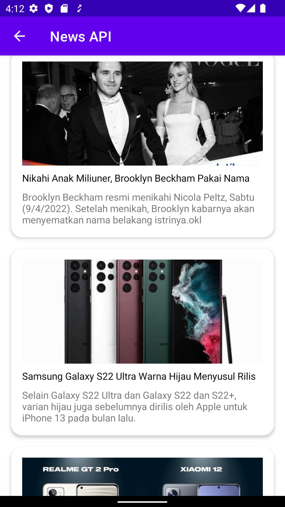
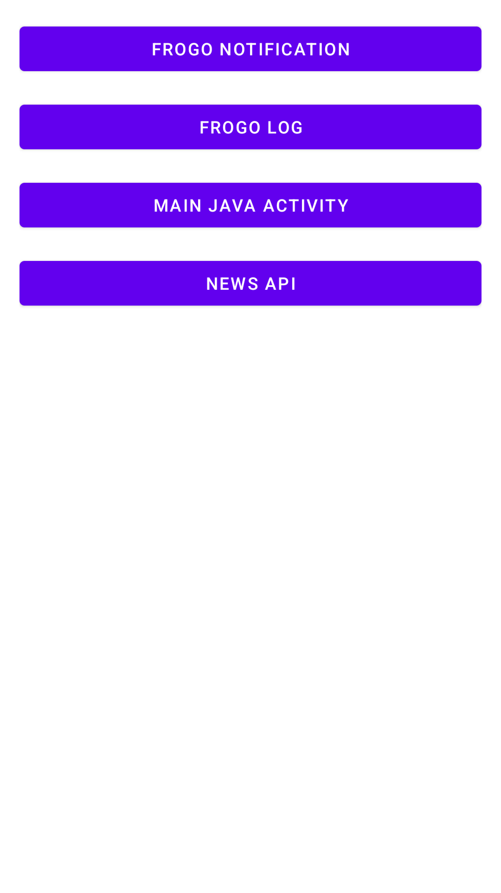
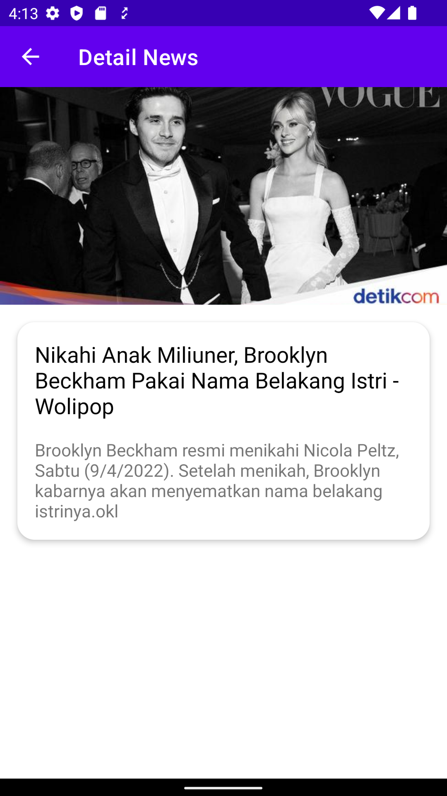

## About This Project (release 👷🔧️👷‍♀️⛏)

[](https://jitpack.io/#frogobox/frogo-sdk)
[](https://github.com/frogobox/frogo-sdk/actions/workflows/android-ci.yml)
[](https://github.com/frogobox/frogo-sdk/actions/workflows/detekt-analysis.yml)
[](https://github.com/frogobox/frogo-sdk/actions/workflows/pages/pages-build-deployment)

- SDK for anything your problem to make easier developing android apps
- Available for android and desktop
- Privacy Policy [Click Here](https://github.com/frogobox/frogo-sdk/blob/master/PRIVACY-POLICY.md)
- License [Click Here](https://github.com/frogobox/frogo-sdk/blob/master/LICENSE)

## ScreenShoot

<table>

<tr>
    <th>SS 1</th>
    <th>SS 2</th>
    <th>SS 3</th>
    <th>SS 4</th>
</tr>

<tr>
    <td></td>
    <td></td>
    <td></td>
    <td></td>
</tr>

</table>

## Version Release

This Is Latest Release

    $version_release = 2.1.0

What's New??

    * SDK Android and Desktop *
    * Update latest version library *
    

## Download this project

### Step 1. Add the JitPack repository to your build file (build.gradle : Project)

#### <Option 1> Groovy Gradle

    // Add it in your root build.gradle at the end of repositories:

    allprojects {
        repositories {
            ...
            maven { url 'https://jitpack.io' }
        }
    }

#### <Option 2> Kotlin DSL Gradle

```kotlin
// Add it in your root build.gradle.kts at the end of repositories:

allprojects {
    repositories {
        ...
        maven("https://jitpack.io")
    }
}
```

### Step 2. Add the dependency (build.gradle : Module)

    #### <Option 1> Groovy Gradle

        dependencies {
            // library frogo-sdk
            implementation 'com.github.frogobox:frogo-sdk:2.1.0'

            // library frogo-sdk for desktop
            implementation 'com.github.frogobox.frogo-sdk:frogocoresdk:2.1.0'
        }

    #### <Option 2> Kotlin DSL Gradle

        dependencies {
            // library frogo-sdk
            implementation("com.github.frogobox:frogo-sdk:2.1.0")

            // library frogo-sdk for desktop
            implementation("com.github.frogobox.frogo-sdk:frogocoresdk:2.1.0")
        }

### Step 3. Function from this SDK

#### All Class SDK (android)

```kotlin
FrogoActivity
FrogoApplication
FrogoComposeActivity
FrogoFragment
FrogoFunc
FrogoMusic
FrogoMutableLiveData
FrogoNavigation
FrogoPagerHelper
FrogoPiracyActivity
FrogoPreference
FrogoSinglePreference
FrogoViewModel
```

### All Class SDK (desktop & android)

```kotlin
FrogoApiClient
FrogoApiModel
FrogoApiObserver
FrogoConstant
FrogoDataResponse
FrogoDate
FrogoLocalObserver
FrogoStateResponse
IFrogoDate
```

#### FrogoActivity

```kotlin
fun setupDetailActivity(title: String)

fun setupChildFragment(frameId: Int, fragment: Fragment)

fun showToast(message: String)

fun setupEmptyView(view: View, isEmpty: Boolean)

fun setupProgressView(view: View, isProgress: Boolean)

fun checkExtra(extraKey: String): Boolean

fun <Model> FrogoFragmentNewInstance(
    fragment: FrogoFragment<*>,
    argumentKey: String,
    extraDataResult: Model
)

fun isNetworkConnected(): Boolean

fun setupFullScreen()

fun setupHideSystemUI()

fun shareApp(packageName: String, appName: String)

fun rateApp(packageName: String)
```

#### FrogoFragment

```kotlin
fun setupChildFragment(frameId: Int, fragment: Fragment)

fun checkArgument(argsKey: String): Boolean

fun setupEmptyView(view: View, isEmpty: Boolean)

fun setupProgressView(view: View, isProgress: Boolean)

fun showToast(message: String)

fun <Model> frogoNewInstance(argsKey: String, data: Model)
```

### Ext Function

#### FrogoRetrofitExt.kt

```kotlin

// Single Api Request
fun <T : Any> Call<T>.doApiRequest(callback: FrogoDataResponse<T>) {

    callback.onShowProgress()
    enqueue(object : Callback<T> {
        override fun onResponse(call: Call<T>, response: Response<T>) {
            response.body()?.let { callback.onSuccess(it) }
            callback.onHideProgress()
        }

        override fun onFailure(call: Call<T>, t: Throwable) {
            callback.onFailed(500, t.localizedMessage)
            callback.onHideProgress()
        }
    })

}

```

#### FrogoRxJavaObservableExt.kt

```kotlin

// Single Api Request with scheduler
fun <T : Any> Observable<T>.doApiRequest(scheduler: Scheduler, callback: FrogoDataResponse<T>) {
    subscribeOn(Schedulers.io())
        .doOnSubscribe { callback.onShowProgress() }
        .doAfterTerminate { callback.onHideProgress() }
        .observeOn(scheduler)
        .subscribe(object : FrogoApiObserver<T>() {
            override fun onSuccess(data: T) {
                callback.onSuccess(data)
            }

            override fun onFailure(code: Int, errorMessage: String) {
                callback.onFailed(code, errorMessage)
            }
        })
}

// -------------------------------------------------------------------------------------------------

// Single Api Request
fun <T : Any> Observable<T>.doApiRequest(callback: FrogoDataResponse<T>) {
    doOnSubscribe { callback.onShowProgress() }
        .doAfterTerminate { callback.onHideProgress() }
        .subscribe(object : FrogoApiObserver<T>() {
            override fun onSuccess(data: T) {
                callback.onSuccess(data)
            }

            override fun onFailure(code: Int, errorMessage: String) {
                callback.onFailed(code, errorMessage)
            }
        })
}

```

#### FrogoContextActivityExt.kt

```kotlin

inline fun <reified ClassActivity> Context.singleStartActivity() {
    FLog.d("Activity : ${ClassActivity::class.java.simpleName}")
    startActivity(Intent(this, ClassActivity::class.java))
}

// -------------------------------------------------------------------------------------------------

inline fun <reified ClassActivity, reified Model> Context.singleStartActivity(
    extraKey: String,
    data: Model
) {
    val intent = Intent(this, ClassActivity::class.java)
    val extraData = Gson().toJson(data)
    intent.putExtra(extraKey, extraData)
    FLog.d("Activity : ${ClassActivity::class.java.simpleName}")
    FLog.d("Data     : Extra Data (${Model::class.java.simpleName}) : $extraData")
    startActivity(intent)
}

// -------------------------------------------------------------------------------------------------

inline fun <reified Model> Activity.singleGetExtraData(extraKey: String): Model {
    val extraIntent = intent.getStringExtra(extraKey)
    return Gson().fromJson(extraIntent, Model::class.java)
}

// -------------------------------------------------------------------------------------------------

fun Context.singleStartActivityShareApp(subject: String, text: String) {
    val intent = Intent(Intent.ACTION_SEND)
    intent.type = "text/plain"
    intent.putExtra(Intent.EXTRA_SUBJECT, subject)
    intent.putExtra(Intent.EXTRA_TEXT, text)
    FLog.d("$TAG : Subject Share App : $subject")
    FLog.d("$TAG : Message Share App : $text")
    startActivity(Intent.createChooser(intent, subject))
}

// -------------------------------------------------------------------------------------------------

fun Context.singleStartActivityOpenApp(url: String) {
    FLog.d("$TAG : Url : $url")
    startActivity(Intent(Intent.ACTION_VIEW, Uri.parse(url)))
}

```

#### FrogoContextFragmentExt.kt

```kotlin

fun <Model> Fragment.singleNewInstance(argsKey: String, data: Model) {
    val argsData = Gson().toJson(data)
    val bundleArgs = Bundle().apply {
        putString(argsKey, argsData)
    }
    this.arguments = bundleArgs
}

// -------------------------------------------------------------------------------------------------

inline fun <reified Model> Fragment.singleGetInstance(argsKey: String): Model {
    val argsData = this.arguments?.getString(argsKey)
    return Gson().fromJson(argsData, Model::class.java)
}

```

#### FrogoImageViewExt.kt

```kotlin

fun ImageView.glideLoad(data: Any?) {
    FLog.d("$TAG : Params : $data")
    FLog.d("$TAG : Glide Load Ext")
    Glide.with(context).load(data).into(this)
}

```

#### FrogoViewExt.kt

```kotlin

fun View.visible() {
    FLog.d("$TAG : View Visible")
    visibility = View.VISIBLE
}

// -------------------------------------------------------------------------------------------------

fun View.gone() {
    FLog.d("$TAG : View Gone")
    visibility = View.GONE
}

// -------------------------------------------------------------------------------------------------

fun View.invisible() {
    FLog.d("$TAG : View Invisible")
    visibility = View.INVISIBLE
}

// -------------------------------------------------------------------------------------------------

fun View.progressViewHandle(isProgressState: Boolean) {
    FLog.d("$TAG : isProgressState >> $isProgressState")
    if (isProgressState) {
        visible()
    } else {
        gone()
    }
}

// -------------------------------------------------------------------------------------------------

fun View.emptyViewHandle(isEmptyState: Boolean) {
    FLog.d("$TAG : isEmptyState >> $isEmptyState")
    if (isEmptyState) {
        visible()
    } else {
        gone()
    }
}

```

#### FrogoContextExt.kt

```kotlin

fun Context.getAppVersionCode(): Int? {
    try {
        return packageManager?.getPackageInfo(packageName, 0)
            ?.let { PackageInfoCompat.getLongVersionCode(it).toInt() }
    } catch (ex: Exception) {
        FLog.e("$TAG : ${ex.message.orEmpty()}")
    }

    return null
}

// -------------------------------------------------------------------------------------------------

fun Context.showToast(
    message: String,
    duration: Int = Toast.LENGTH_SHORT
) {
    Toast.makeText(this, message, duration).show()
}

// -------------------------------------------------------------------------------------------------

fun Context.hasCameraPermission(): Boolean =
    ContextCompat.checkSelfPermission(
        this,
        Manifest.permission.CAMERA
    ) == PackageManager.PERMISSION_GRANTED

// -------------------------------------------------------------------------------------------------

fun Context.hasReadExtStoragePermission(): Boolean {
    return ContextCompat.checkSelfPermission(
        this,
        Manifest.permission.READ_EXTERNAL_STORAGE
    ) == PackageManager.PERMISSION_GRANTED
}

fun Context.hasWriteExtStoragePermission(): Boolean {
    return ContextCompat.checkSelfPermission(
        this,
        Manifest.permission.WRITE_EXTERNAL_STORAGE
    ) == PackageManager.PERMISSION_GRANTED
}

```

### Added Function

<details>
<summary>Click for detail !!!</summary>

## FrogoLog

- SDK for your Log problem to make easier developing android apps
- frogo-log is Long Term Service
- Line number show
- Toast for easy develop and debug

### Screenshoot Result

<table>
    <tr>
        <th>SS 1</th>
        <th>SS 2</th>
        <th>SS 3</th>
        <th>SS 4</th>
    </tr>
    <tr>
        <td></td>
        <td></td>
        <td></td>
        <td></td>
    </tr>
<table>

### Screenshoot Library Sample


### FrogoLog (with line code)

```kotlin
// Function Log Debug
FrogoLog.d("Debug")

// Function Log Info
FrogoLog.i("Info")

// Function Log Verbose
FrogoLog.v("Verbose")

// Function Log Warn
FrogoLog.w("Warn")

// Function Log Error
FrogoLog.e("Error")

// Function Log Simple Debug without message params
FrogoLog.d()

```

### FrogoLog (with line code and Toast)

```kotlin
// Function Log Debug (adding context params)
FrogoLog.d("Debug", this@MainActivity)

// Function Log Info (adding context params)
FrogoLog.i("Info", this@MainActivity)

// Function Log Verbose
FrogoLog.v("Verbose", this@MainActivity)

// Function Log Warn (adding context params)
FrogoLog.w("Warn", this@MainActivity)

// Function Log Error (adding context params)
FrogoLog.e("Error", this@MainActivity)

// Function Log Simple Debug without message params
FrogoLog.d(this@MainActivity)
```

### FLog (without line code)

```kotlin
// Function Log Debug
FLog.d("Debug")

// Function Log Info
FLog.i("Info")

// Function Log Verbose
FLog.v("Verbose")

// Function Log Warn
FLog.w("Warn")

// Function Log Error
FLog.e("Error")

// Function Log Simple Debug without message params
FLog.d()
```

### Flog (without line code with toast)

```kotlin
// Function Log Debug (adding context params)
FLog.d("Debug", this@MainActivity)

// Function Log Info (adding context params)
FLog.i("Info", this@MainActivity)

// Function Log Verbose
FLog.v("Verbose", this@MainActivity)

// Function Log Warn (adding context params)
FLog.w("Warn", this@MainActivity)

// Function Log Error (adding context params)
FLog.e("Error", this@MainActivity)

// Function Log Simple Debug without message params
FLog.d(this@MainActivity)
```

### Result FrogoLog


## FrogoNotification

- SDK for your notification problem to make easier developing android apps
- frogo-notification is under huge large development
- Notification with singleton method
- Simple and eazy to use
- With many feature
- Full documentation
- Custom Layout Notification

### Screenshoot Sample

<table>
    <tr>
        <th>Simple Notification</th>
        <th>Stack Notification</th>
        <th>Custom Notification (1)</th>
        <th>Custom Notification (2)</th>
    </tr>
    <tr>
        <td></td>
        <td></td>
        <td></td>
        <td></td>
    </tr>
</table>

```kotlin
FrogoNotification.Inject(this) // Intialize for Context
    .setChannelId(CHANNEL_ID) // Intialize for Channel ID
    .setChannelName(CHANNEL_NAME) // Initialize for Channel Name
    .setContentIntent(pendingIntent) // Initialize for Content Intent
    .setSmallIcon(R.drawable.ic_frogo_notif) // Initialize for Small Icon
    .setLargeIcon(R.drawable.ic_frogo_notif) // Initialize for Large Icon
    .setContentTitle(resources.getString(R.string.content_title)) // Initialize for Content Title
    .setContentText(resources.getString(R.string.content_text)) // Initialize for Content Text
    .setSubText(resources.getString(R.string.subtext)) // Initialize for Sub Text
    .setupAutoCancel() // Initialize for Auto Cancel
    .build() // Build the Frogo Notification
    .launch(NOTIFICATION_ID) // Notify the Frogo Notification
```

### Simple Notification

```kotlin
FrogoNotification.Inject(this) // Intialize for Context
    .setChannelId(CHANNEL_ID) // Intialize for Channel ID
    .setChannelName(CHANNEL_NAME) // Initialize for Channel Name
    .setContentIntent(pendingIntent) // Initialize for Content Intent
    .setSmallIcon(R.drawable.ic_frogo_notif) // Initialize for Small Icon
    .setLargeIcon(R.drawable.ic_frogo_notif) // Initialize for Large Icon
    .setContentTitle(resources.getString(R.string.content_title)) // Initialize for Content Title
    .setContentText(resources.getString(R.string.content_text)) // Initialize for Content Text
    .setSubText(resources.getString(R.string.subtext)) // Initialize for Sub Text
    .setupAutoCancel() // Initialize for Auto Cancel
    .build() // Build the Frogo Notification
    .launch(NOTIFICATION_ID) // Notify the Frogo Notification
```

### Custom Layout (NEW FEATURE)

```kotlin
val collapsed = object : FrogoNotifCustomContentViewListener {
    override fun setupCustomView(): Int {
        return R.layout.notification_collapsed
    }

    override fun setupComponent(context: Context, customView: RemoteViews) {
        customView.apply {
            setTextViewText(R.id.text_view_collapsed_1, "Hello World!")
        }
    }
}

val expanded = object : FrogoNotifCustomContentViewListener {
    override fun setupCustomView(): Int {
        return R.layout.notification_expanded
    }

    override fun setupComponent(context: Context, customView: RemoteViews) {
        customView.apply {
            setImageViewResource(R.id.image_view_expanded, R.drawable.ic_android)
            setOnClickPendingIntent(R.id.image_view_expanded, clickPendingIntent)
        }
    }
}

FrogoNotification.Inject(this) // Intialize for Context
    .setChannelId(FrogoApp.CHANNEL_ID) // Intialize for Channel ID
    .setChannelName(FrogoApp.CHANNEL_NAME) // Initialize for Channel Name
    .setSmallIcon(R.drawable.ic_android) // Initialize for Small Icon
    .setCustomContentView(collapsed)
    .setCustomBigContentView(expanded)
    .build() // Build the Frogo Notification
    .launch(FrogoApp.NOTIFICATION_ID) // Notify the Frogo Notification
```

### With Action Replay

```kotlin
FrogoNotification.Inject(this)
    .setChannelId(CHANNEL_ID)
    .setChannelName(CHANNEL_NAME as String)
    .setSmallIcon(R.drawable.ic_frogo_notif)
    .setContentTitle(getString(R.string.notif_title))
    .setContentText(getString(R.string.notif_content))
    .setupShowWhen()
    .setupActionRemoteInput(object : FrogoNotifActionRemoteInputListener {
        override fun setRemoteInputResultKey(): String {
            return KEY_REPLY
        }

        override fun setRemoteInputLabel(): String {
            return getString(R.string.notif_action_reply)
        }

        override fun setActionIcon(): Int {
            return R.drawable.ic_frogo_send
        }

        override fun setActionTitle(): String {
            return getString(R.string.notif_action_reply)
        }

        override fun setActionIntent(): PendingIntent? {
            return getReplyPendingIntent()
        }

        override fun setAllowGeneratedReplies(): Boolean {
            return true
        }
    })
    .build()
    .launch(mNotificationId)
```

### With Inbox Style (Stack)

```kotlin
val frogoNotification = FrogoNotification.Inject(this)
    .setChannelId(CHANNEL_ID)
    .setChannelName(CHANNEL_NAME)
    .setSmallIcon(R.drawable.ic_frogo_email)
    .setGroup(GROUP_KEY_EMAILS)
    .setContentIntent(pendingIntent)
    .setupAutoCancel()

// Check if NotificationID is smaller than Max Notif
if (idNotification < MAX_NOTIFICATION) {

    stackNotif[idNotification].message?.let {
        frogoNotification
            .setContentTitle("New Email from " + stackNotif[idNotification].sender)
            .setContentText(it)
            .setLargeIcon(R.drawable.ic_frogo_notif)
    }

} else {

    frogoNotification
        .setContentTitle("$idNotification new emails")
        .setContentText("mail@frogobox.com")
        .setGroupSummary()
        .setupInboxStyle(object : FrogoNotifInboxStyleListener {
            override fun addLine1(): String {
                return "New Email from " + stackNotif[idNotification].sender
            }

            override fun addLine2(): String {
                return "New Email from " + stackNotif[idNotification - 1].sender
            }

            override fun setBigContentTitle(): String {
                return "$idNotification new emails"
            }

            override fun setSummaryText(): String {
                return "mail@frogobox"
            }
        })

}

frogoNotification
    .build()
    .launch(idNotification)
```

### With Frogo Style

```kotlin
FrogoNotification.Inject(this) // Intialize for Context
    .setSmallIcon(R.drawable.ic_frogo_notif) // Initialize for Small Icon
    .setupWithFrogoStyle()
    .build() // Build the Frogo Notification
    .launch(NOTIFICATION_ID) // Notify the Frogo Notification
```

### For Documentation

- Method with
  description [Click Here](https://github.com/amirisback/frogo-notification/blob/master/frogonotification/src/main/java/com/frogobox/frogonotification/IFrogoNotification.kt)
- Simple
  Notification [Click Here](https://github.com/amirisback/frogo-notification/blob/master/app/src/main/java/com/frogobox/notification/simple/MainActivity.kt)
- With Action
  Replay [Click Here](https://github.com/amirisback/frogo-notification/blob/master/app/src/main/java/com/frogobox/notification/custom/NotificationService.kt)
- With Inbox Style (
  Stack) [Click Here](https://github.com/amirisback/frogo-notification/blob/master/app/src/main/java/com/frogobox/notification/stack/StackNotifActivity.kt)

</details>

## Colaborator

Very open to anyone, I'll write your name under this, please contribute by sending an email to me

- Mail To faisalamircs@gmail.com
- Subject : Github _ [Github-Username-Account] _ [Language] _ [Repository-Name]
- Example : Github_amirisback_kotlin_admob-helper-implementation

Name Of Contribute

- Muhammad Faisal Amir
- Waiting List
- Waiting List

Waiting for your contribute

## Attention !!!

- Please enjoy and don't forget fork and give a star
- Don't Forget Follow My Github Account

