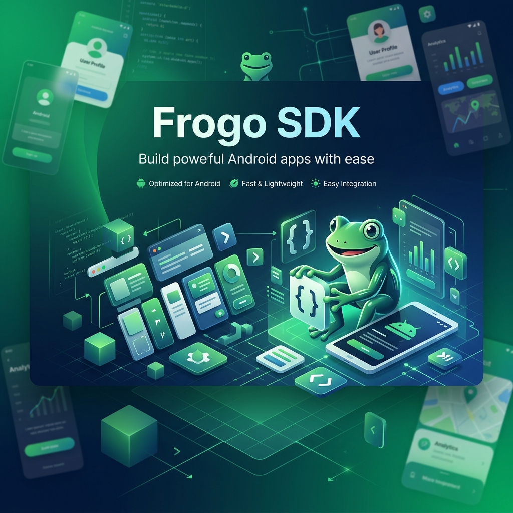
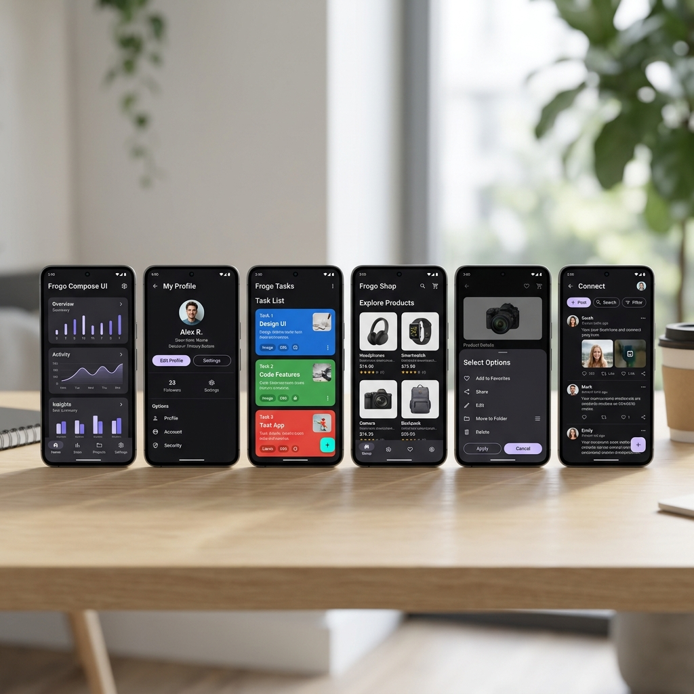

# Frogo SDK 🚀
### The Ultimate Android & Desktop Development Toolkit



[](https://jitpack.io/#frogobox/frogo-sdk)
[](https://github.com/frogobox/frogo-sdk/actions/workflows/android-ci.yml)
[](https://github.com/frogobox/frogo-sdk/blob/master/LICENSE)
[](http://makeapullrequest.com)

**Frogo SDK** is a comprehensive suite of Android libraries designed to accelerate your development workflow. From stunning Jetpack Compose UIs to seamless AdMob integration, Frogo SDK provides the building blocks you need to create high-quality apps faster.

---

## 🌟 Key Features

- **🎨 Frogo Compose UI**: 60+ reusable Jetpack Compose widgets and professional templates.
- **📢 Frogo Ext Ads**: Simplify AdMob integration with easy-to-use wrappers for Banner, Interstitial, and Native ads.
- **♻️ Frogo UI RecyclerView**: Advanced RecyclerView helpers for painless list management.
- **🛠️ Frogo Core**: Essential utilities, base classes, and extensions for Kotlin development.
- **📱 Multi-Platform**: Available for both Android and Desktop environments.

---

## 📸 Screenshots & Mockups

### Premium Jetpack Compose Components

*Beautiful, modern, and highly customizable UI components following Material Design 3.*

### Seamless Ad Integration

*Monetize your apps effortlessly with optimized ad placements.*

---

## 🚀 Quick Start

### Step 1: Add JitPack Repository
Add it to your `settings.gradle.kts` (or root `build.gradle`):

```kotlin
dependencyResolutionManagement {
    repositoriesMode.set(RepositoriesMode.FAIL_ON_PROJECT_REPOS)
    repositories {
        google()
        mavenCentral()
        maven("https://jitpack.io")
    }
}
```

### Step 2: Add Dependencies
Latest Version: `2.3.7`

```kotlin
dependencies {
    // Core SDK
    implementation("com.github.frogobox:frogo-sdk:2.3.7")

    // Or specific modules (recommended)
    implementation("com.github.frogobox.frogo-sdk:frogo-compose-ui:2.3.7")
    implementation("com.github.frogobox.frogo-sdk:frogo-ext-ads:2.3.7")
}
```

---

## 📦 Modules Overview

| Module | Description | Key Features |
| :--- | :--- | :--- |
| `frogo-compose-ui` | Modern UI Kit | Widgets, Dialogs, Bottom Sheets, Scaffolds |
| `frogo-ext-ads` | Monetization Kit | Easy AdMob Integration (Banner, Interstitial, Native) |
| `frogo-ui-recyclerview` | List Management | Multi-view adapters, simplified ViewHolders |
| `frogo-core-android` | Core Utilities | Extensions, Base Classes, Lifecycle Helpers |

---

## 🤝 Contributing

We welcome contributions! Whether you're fixing a bug or suggesting a new feature, your help is appreciated.

1. Fork the Project
2. Create your Feature Branch (`git checkout -b feature/AmazingFeature`)
3. Commit your Changes (`git commit -m 'Add some AmazingFeature'`)
4. Push to the Branch (`git push origin feature/AmazingFeature`)
5. Open a Pull Request

---

## 📄 License & Privacy

- **License**: Distributed under the [Apache 2.0 License](https://github.com/frogobox/frogo-sdk/blob/master/LICENSE).
- **Privacy Policy**: Read our policy [here](https://github.com/frogobox/frogo-sdk/blob/master/PRIVACY-POLICY.md).

---

## 📬 Contact

**Muhammad Faisal Amir** - [faisalamircs@gmail.com](mailto:faisalamircs@gmail.com)

Project Link: [https://github.com/frogobox/frogo-sdk](https://github.com/frogobox/frogo-sdk)

---

<!-- SEO Keywords (Hidden) -->
<!-- 
Keywords: Android SDK, Jetpack Compose UI Library, Kotlin Android, Android UI Components, AdMob Helper, RecyclerView Adapter, Android Development Tools, Frogo SDK, Android Library, Material Design 3, Android Monetization, Android UI Kit
-->

